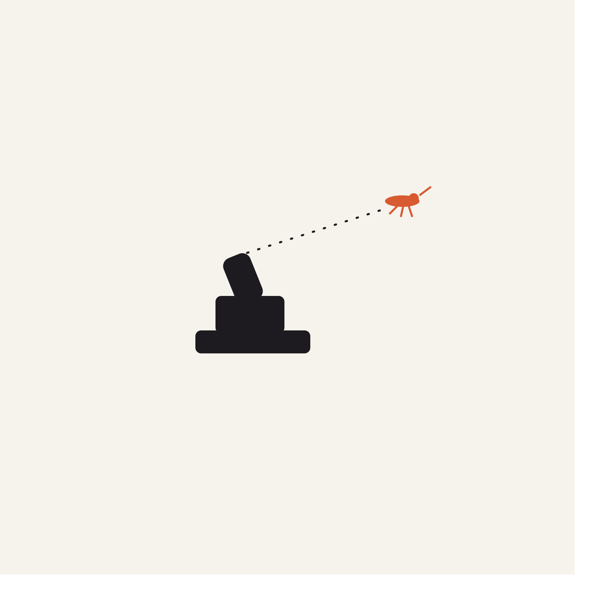

# buzzkill


Nerf turret that shoots swinging paper mosquitoes. Hack the 6ix 2026.

## Architecture

```
[Pi Camera CSI]
     │
     ▼
[RP5 running QNX]
  detect.py   OpenCV motion detection → P-controller per axis → serial to ESP32
                                                                       │
                                                                       ▼
                                                                  [ESP32]
                                                                  pan / tilt servos
                                                                  flywheel + pusher
```

Everything runs on the Pi. The ESP32 is a dumb executor for servo PWM and firing timing.

## Layout

```
pi/                 all Python — runs on the RP5/QNX box
├── detect.py       OpenCV pipeline (camera → P-controller → serial), the run file
├── tracker.py      EMA smoothing + lead prediction + fire decision
├── servo.py        MockServo / SerialServo (talks to ESP32 sketch)
├── calibration.py  4-corner bilinear pixel→angle map
├── calibrate.py    interactive calibration tool
├── config/calibration.json
└── requirements.txt

arduino/buzzkill/buzzkill.ino    ESP32 firmware
```

## Setup on the Pi

```
# On QNX, first time:
sudo apk update
sudo apk add py3-opencv python3-pip
python3 -m pip install pyserial   # opencv from apk; only pyserial from pip

# Verify camera:
python3 -c "import cv2; c=cv2.VideoCapture(0); ok,_=c.read(); print(ok)"
```

## Run

One terminal on the Pi:

```
cd pi
python3 detect.py --source 0 --serial /dev/serUSB0
```

Wave a hand or swing a paper mosquito. detect.py prints aim commands as it
sends them.

## Dev on a laptop (no Pi needed)

```
cd pi
pip install -r requirements.txt
python3 detect.py --source 0 --dry-run
```

`--dry-run` prints aim commands to stdout instead of writing to serial, so
you can validate the whole pipeline without hardware.

## Calibrate

Once the turret is bolted next to the camera:

```
python3 calibrate.py --source 0 --out config/calibration.json
```

Aim the turret at each frame corner, click that point, enter the pan/tilt
angles you dialed.

## Tuning

Everything the tracker cares about lives in `pi/tracker.py` in `TrackerConfig`:

- `lead_seconds`     — servo + bullet travel time. Bigger = more lead.
- `min_hits_to_fire` — consecutive detections before firing.
- `fire_cooldown_s`  — between shots.
- `min_confidence`   — reject small/weak blobs.

Sketch geometry lives in `arduino/buzzkill/buzzkill.ino`:
`PAN_MIN`/`PAN_MAX`, `TILT_MIN`/`TILT_MAX`, `SERVO_SPEED`.

## Protocol between controller and ESP32

Line-delimited ASCII over USB serial at 115200 baud (see the sketch):

| Command | Meaning |
|---|---|
| `E`               | arm |
| `D`               | disarm |
| `A <pan> <tilt>`  | aim, integer degrees offset from center |
| `F` / `f`         | flywheel on / off |
| `P`               | fire one dart (armed only) |
| `S`               | emergency stop |
